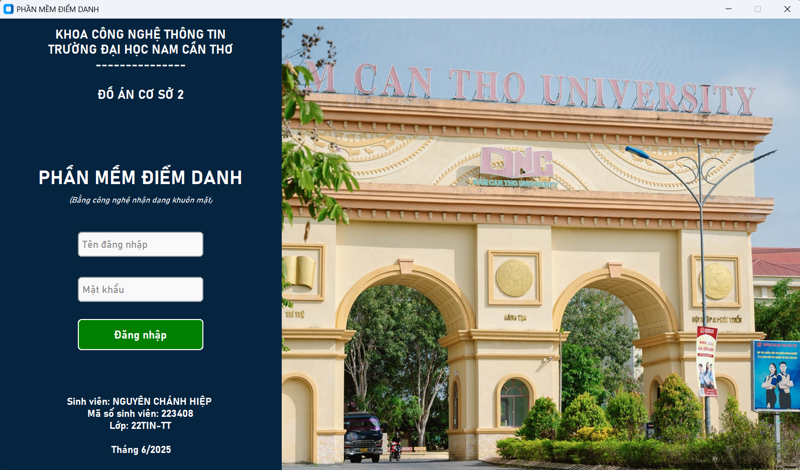
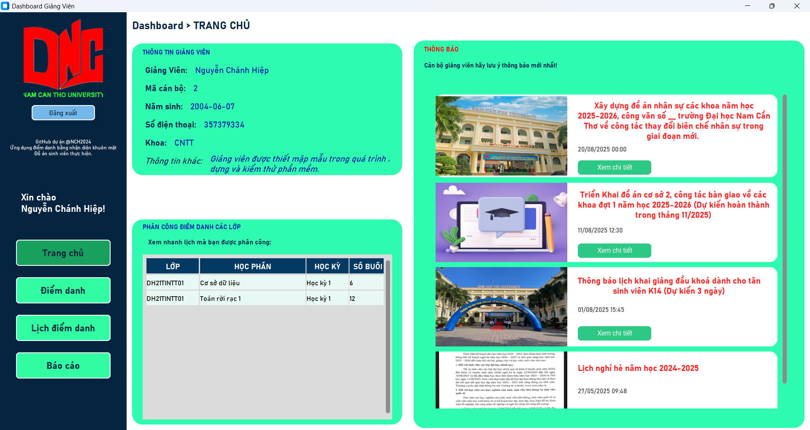
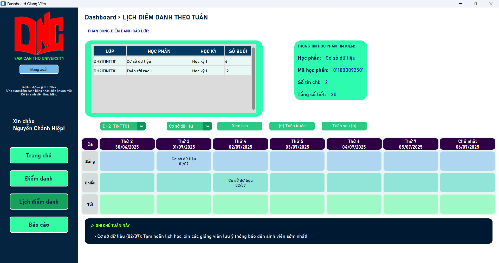

# DACS2

DACS2 là một dự án nhằm phát triển một hệ thống quản lý dữ liệu và điểm danh nhập dang khuôn mặt. Mục tiêu của DACS2 là hỗ trợ người dùng quản lý dữ liệu một cách dễ dàng, an toàn và đáng tin cậy.

## Tính năng nổi bật

- Ứng dụng đang trong quá trình phát triển, chưa tiết lộ thêm
- Demo hình ảnh ứng dụng:

## Đóng góp

Chưa có hình thức với dự án này, vui lòng quay lại sau!
