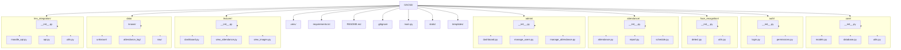

```mermaid
flowchart TD
    A1[DACS2/]
    A2[venv/]
    A3[requirements.txt]
    A4[README.md]
    A5[.gitignore]
    A6[main.py]

    subgraph core/
        B1[__init__.py]
        B2[models.py]
        B3[database.py]
        B4[utils.py]
    end

    subgraph auth/
        C1[__init__.py]
        C2[login.py]
        C3[permissions.py]
    end

    subgraph face_recognition/
        D1[__init__.py]
        D2[detect.py]
        D3[utils.py]
    end

    subgraph attendance/
        E1[__init__.py]
        E2[attendance.py]
        E3[report.py]
        E4[schedule.py]
    end

    subgraph admin/
        F1[__init__.py]
        F2[dashboard.py]
        F3[manage_users.py]
        F4[manage_attendance.py]
    end

    subgraph lecturer/
        G1[__init__.py]
        G2[dashboard.py]
        G3[view_attendance.py]
        G4[view_images.py]
    end

    subgraph data/
        H1[known/]
        H2[unknown/]
        H3[attendance_log/]
        H4[raw/]
    end

    subgraph lms_integration/
        I1[__init__.py]
        I2[moodle_api.py]
        I3[api.py]
        I4[utils.py]
    end

    J1[static/]
    J2[templates/]

    %% Kết nối các node chính
    A1 --> A2
    A1 --> A3
    A1 --> A4
    A1 --> A5
    A1 --> A6
    A1 --> core/
    A1 --> auth/
    A1 --> face_recognition/
    A1 --> attendance/
    A1 --> admin/
    A1 --> lecturer/
    A1 --> J1
    A1 --> J2
    A1 --> data/
    A1 --> lms_integration/

    %% core
    core/ --> B1
    core/ --> B2
    core/ --> B3
    core/ --> B4

    %% auth
    auth/ --> C1
    auth/ --> C2
    auth/ --> C3

    %% face_recognition
    face_recognition/ --> D1
    face_recognition/ --> D2
    face_recognition/ --> D3

    %% attendance
    attendance/ --> E1
    attendance/ --> E2
    attendance/ --> E3
    attendance/ --> E4

    %% admin
    admin/ --> F1
    admin/ --> F2
    admin/ --> F3
    admin/ --> F4

    %% lecturer
    lecturer/ --> G1
    lecturer/ --> G2
    lecturer/ --> G3
    lecturer/ --> G4

    %% data
    data/ --> H1
    data/ --> H2
    data/ --> H3
    data/ --> H4

    %% lms_integration
    lms_integration/ --> I1
    lms_integration/ --> I2
    lms_integration/ --> I3
    lms_integration/ --> I4
```