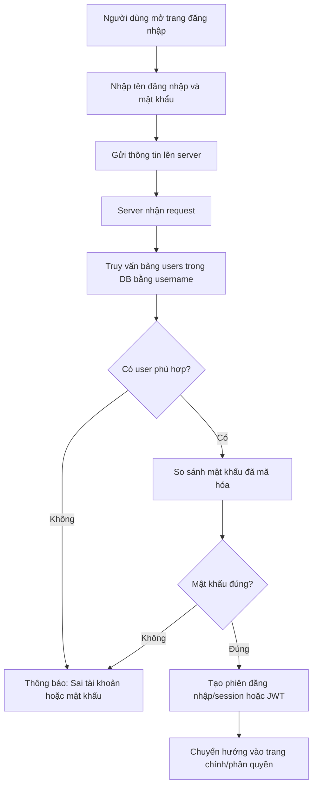

```mermaid
flowchart TD
    A1[Người dùng mở trang đăng nhập] --> A2[Nhập tên đăng nhập và mật khẩu]
    A2 --> B1[Gửi thông tin lên server]
    B1 --> B2[Server nhận request]
    B2 --> C1[Truy vấn bảng users trong DB bằng username]
    C1 --> C2{Có user phù hợp?}
    C2 -- Không --> D1[Thông báo: Sai tài khoản hoặc mật khẩu]
    C2 -- Có --> D2[So sánh mật khẩu đã mã hóa]
    D2 --> D3{Mật khẩu đúng?}
    D3 -- Không --> D1
    D3 -- Đúng --> E1[Tạo phiên đăng nhập/session hoặc JWT]
    E1 --> E2[Chuyển hướng vào trang chính/phân quyền]
```