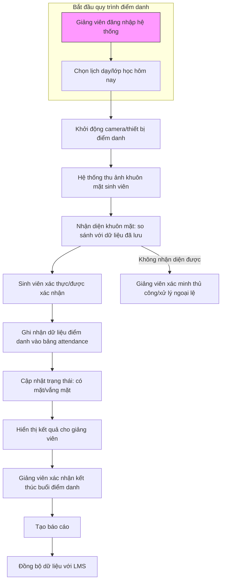

```mermaid
---
config:
  layout: fixed
---
flowchart TD
 subgraph subGraph0["Bắt đầu quy trình điểm danh"]
        A1["Giảng viên đăng nhập hệ thống"]
        A2["Chọn lịch dạy/lớp học hôm nay"]
  end
    A1 --> A2
    A2 --> B1["Khởi động camera/thiết bị điểm danh"]
    B1 --> C1["Hệ thống thu ảnh khuôn mặt sinh viên"]
    C1 --> C2["Nhận diện khuôn mặt: so sánh với dữ liệu đã lưu"]
    C2 --> C3["Sinh viên xác thực/được xác nhận"]
    C3 --> D1["Ghi nhận dữ liệu điểm danh vào bảng attendance"]
    D1 --> D2["Cập nhật trạng thái: có mặt/vắng mặt"]
    D2 --> D3["Hiển thị kết quả cho giảng viên"]
    D3 --> E1["Giảng viên xác nhận kết thúc buổi điểm danh"]
    E1 --> E2["Tạo báo cáo"]
    E2 --> F1["Đồng bộ dữ liệu với LMS"]
    C2 -- Không nhận diện được --> F2["Giảng viên xác minh thủ công/xử lý ngoại lệ"]
    style A1 fill:#f9f,stroke:#333,stroke-width:1px


```