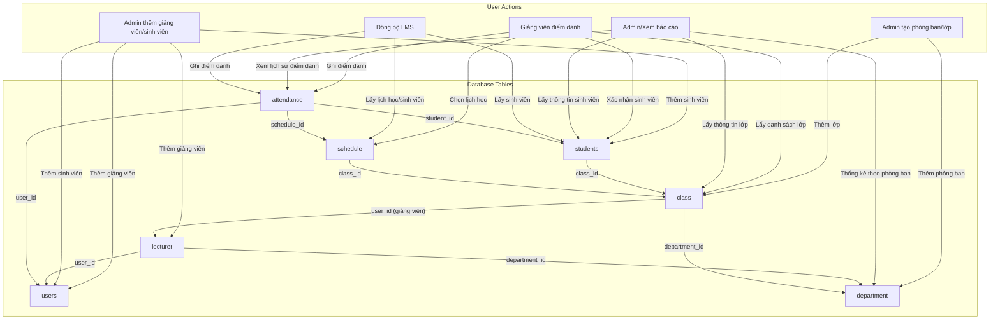

```mermaid
flowchart TD
    subgraph User Actions
        A1[Admin thêm giảng viên/sinh viên]
        A2[Admin tạo phòng ban/lớp]
        A3[Giảng viên điểm danh]
        A4[Admin/Xem báo cáo]
        A5[Đồng bộ LMS]
    end

    subgraph Database Tables
        B1[users]
        B2[department]
        B3[lecturer]
        B4[class]
        B5[students]
        B6[schedule]
        B7[attendance]
    end

    %% Thao tác thêm mới
    A1 -- Thêm giảng viên --> B1
    A1 -- Thêm giảng viên --> B3
    A1 -- Thêm sinh viên --> B1
    A1 -- Thêm sinh viên --> B5
    A2 -- Thêm phòng ban --> B2
    A2 -- Thêm lớp --> B4

    %% Thao tác điểm danh
    A3 -- Chọn lịch học --> B6
    A3 -- Lấy danh sách lớp --> B4
    A3 -- Xác nhận sinh viên --> B5
    A3 -- Ghi điểm danh --> B7

    %% Thao tác báo cáo, tra cứu
    A4 -- Xem lịch sử điểm danh --> B7
    A4 -- Lấy thông tin sinh viên --> B5
    A4 -- Lấy thông tin lớp --> B4
    A4 -- Thống kê theo phòng ban --> B2

    %% Đồng bộ LMS (nếu có)
    A5 -- Lấy lịch học/sinh viên --> B6
    A5 -- Lấy sinh viên --> B5
    A5 -- Ghi điểm danh --> B7

    %% Quan hệ bảng (liên hệ chính/phụ)
    B3 -- user_id --> B1
    B3 -- department_id --> B2
    B4 -- user_id (giảng viên) --> B3
    B4 -- department_id --> B2
    B5 -- class_id --> B4
    B6 -- class_id --> B4
    B7 -- user_id --> B1
    B7 -- schedule_id --> B6
    B7 -- student_id --> B5
```